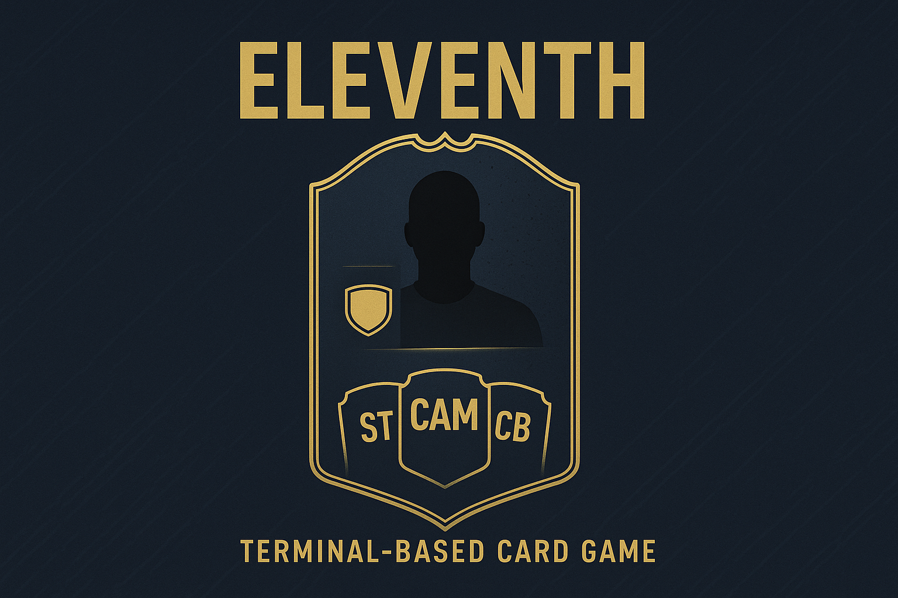
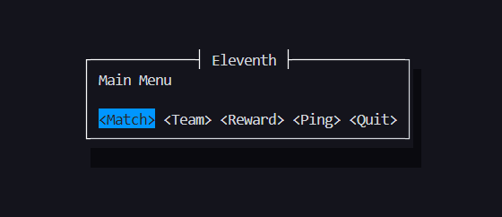
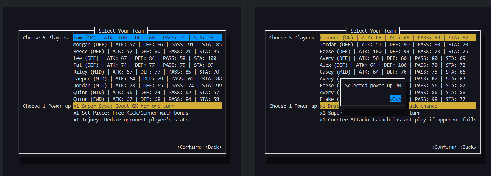

<h1 align="center">Eleventh</h1>

<p align="center">⚽ <em>Only 11 wins</em> 🃏</p>

<p align="center">
    
</p>

**Eleventh** is a turn-based card game inspired by FIFA’s Ultimate Team cards and the strategic style of Soccer Manager.
Players build their own dream team using collectible cards, manage tactics, and compete in tactical duels against other managers. 


## At A Glance

<p align="center">
    
    <p align="center">Eleventh's Main Menu</p>
</p>

<p align="center">
    
    <p align="center">1v1 multiplayer match</p>
</p>


## PBL Context

This project was developed for the subject TEC502 – Concurrency & Connectivity, which is taught using a Problem-Based Learning (PBL) approach.

In PBL, students work in groups to solve open-ended problems, progressing step by step through research, discussion, and implementation. This project in specific is individual, but sessions are organized in group to share experiences and brainstorming.

Because of this nature, I've created the `.project/` folder that have the sessions summaries, goals and others.

## Usage

### Development

To use the system locally without Docker, see the following instructions.
This is needed to ensure portability, mainly for systems that can't run Docker,
and also quick development, where build time counts a lot.

**Starting the server**

```sh
$ cargo run -p server
```

**Starting the client** (Do for every client)

```sh
$ cargo run -p eleventh
```

**Running tests**

```sh
$ cargo test
```

### Production

Required by the problem, the production environment is Docker-based,
where the server and each client are into their own containers.

**Building the whole system**

> [!NOTE]
> You can't just use `docker compose up`, and instead, you need to build it before
> actually run. This happens because the peers doesn't interact with them automatically,
> clients needs to interact via terminal (so this needs a user to control it).
> Due to this nature, you need to build it, and then run each on their own terminal.

```sh
$ docker compose build
```

**Starting the server**

```sh
$ docker compose run --rm server
```

**Starting the client** (for each one)

> [!TIP]
> If you're using a terminal emulator that supports split terminals, just do this.
> The TUI simply resizes itself to adapt to the terminal size, so I hope there is 
> no problem doing it if the horizontal size is enough.
> 
> VsCode, Windows Terminal have support to split it. This would improve your workflow for testing.
> On VsCode, I generally put the server on top and two clients side-by-side on bottom.

```sh
$ docker compose run --rm client
```

## Stress test

To run stress test, read the [Faint!'s documentation](./faint/Readme.md), this will give you the complete documentation of the CLI and also examples of usage. Make sure you're running your server locally for that. 

> [!TIP]
> Enable OS tune for high concurrency by executing the script `tune.sh`.

## Manually testing the system routes

If you want to know if the system works well with external tools, you may use `curl` for any HTTP endpoint declared.
Remember, if you need to change the method, use `-X <METHOD>` and a body, use `-d <BODY>`. Make sure you have your server running locally.

### Account Creation Example

```sh
$ curl http://127.0.0.1:8080/accounts/
$ curl -X POST http://127.0.0.1:8080/accounts/create/ -d '{"username": "Rick", "password": "123456"}'
$ curl -X POST http://127.0.0.1:8080/accounts/login/ -d '{"username": "Rick", "password": "123456"}'
```